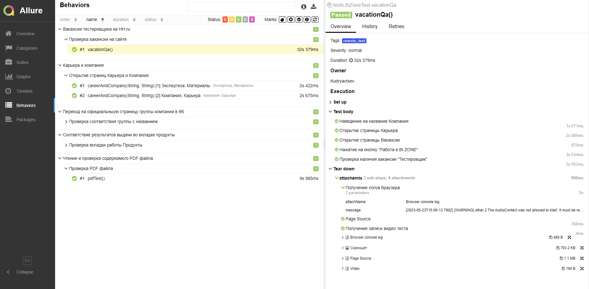
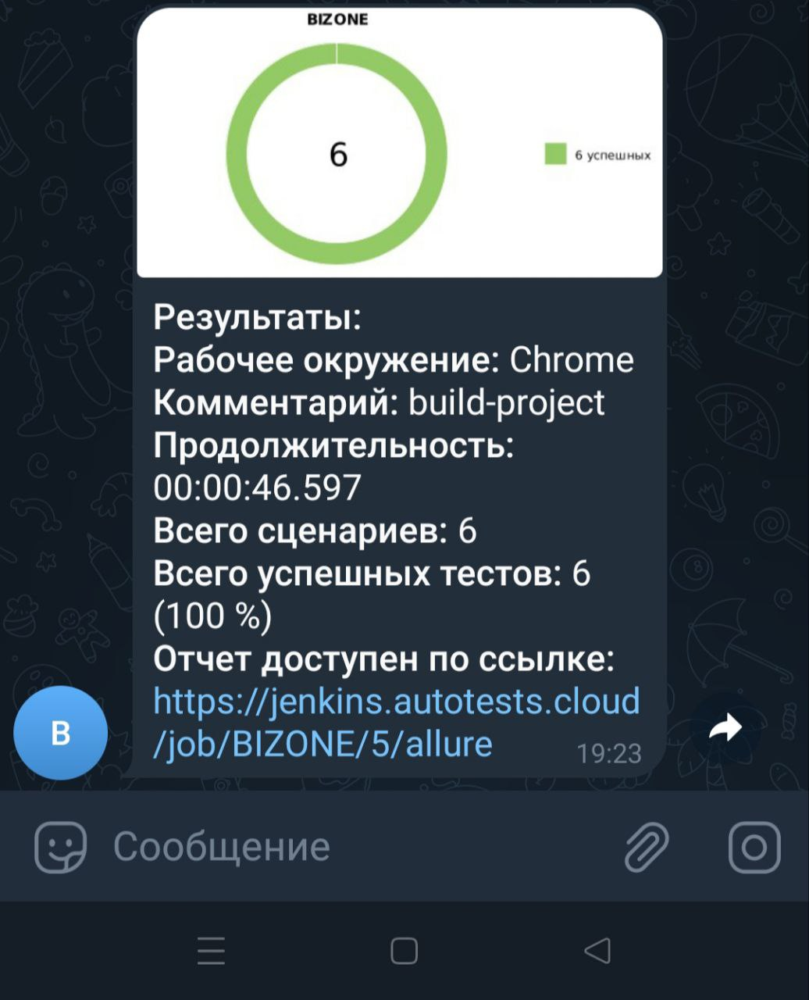

<h1>Добро пожаловать!</br> 

# <a name="TableOfContents">Содержание страницы</a>
+ [:trophy: Мои инструменты и технологии](#MyToolsAndTechnologies)
+ [Описаниe](#Description)

+ [Проект](#Project)
+ [:heavy_check_mark:  Реализованные проверки:](#ImplementedСhecks)
+ [👷‍♂️ Сборка в Jenkins](#Build_in_Jenkins)
+ [:clipboard: Параметры сборки в Jenkins:](#Build_Parameters_in_Jenkins)
+ [:computer: Запуск из терминала](#Launch_from_terminal)
+ [:chart_with_downwards_trend: Allure отчет](#Allure_report)
    + [Главный экран отчета](#Allure_report1)
    + [Страница с проведенными тестами](#Allure_report2)
+ [:iphone: Отчет в Telegram](#Telegram)
+ [:movie_camera: Видео примеры прохождения тестов](#Video)

<a name="MyToolsAndTechnologies"><h2>:trophy: Мои инструменты и технологии</h2></a>
<p  align="center">

</br>

<a name="Description"><h2>Описаниe</h2></a>
Автотесты в этом проекте написаны на `Java` с использованием `Selenide`.\
`Gradle` - для автоматической системы сборки.  \
`JUnit5` - для модульного тестирования.\
`Jenkins` - CI/CD для удаленного запуска тестов.\
`Selenoid` - для удаленного запуска браузеров в `Docker` контейнере.\
`Allure Report` - для визуализации результатов тестирования.\
`Telegram Bot` - для уведомлений о результатах тестирования.\

<a name="Project"><h2>Проект</h2></a>
<a href="https://bi.zone/"><code></code></a> Проект по автоматизации тестирования для BI.ZONE — компания по управлению цифровыми рисками.
 :star2:
 
 <a name="ImplementedСhecks"><h2>:heavy_check_mark:  Реализованные проверки:</h2></a>
 
 :clipboard: Наличие вакансии тестировщика на HH 'Выживание'</br>
 
 :speech_balloon: Переход на официальныую страницу группы компании в ВК
  </br>
 
 :clipboard: Открытие страниц Карьера и Компания
</br>

🔎 Соответствие результатов выдачи во вкладке продукты
</br>
 
 :card_index_dividers: Чтение и проверка содержимого PDF файла
 </br>

<a name="Launch_from_terminal"><h2>:computer: Запуск из терминала</h2></a>

Локальный запуск:

```

gradle clean test

```

Удаленный запуск:

```

clean
${TASK}
-Dbrowser=${BROWSER}
-Dbrowser_version=${BROWSER_VERSION}
-Dbrowser_size=${BROWSER_SIZE}
-Dbaseurl=${BASEURL}
-Dselenoid_url=${SELENOID_URL}
```
<a name="Allure_report"><h2>:chart_with_downwards_trend: Allure отчет</h2></a>

- <a name="Allure_report1"><h3>Главный экран отчета</h3></a>


-  <a name="Allure_report2"><h3>Страница с проведенными тестами</h3></a>



<a name="Telegram"><h2>:iphone: Отчет в Telegram</h2></a>



<a name="Video"><h2>:movie_camera: Видео примеры прохождения тестов</h2></a>

- <a name="Video1"><h3>Пример запуска тестов через selenoid</h3></a>
https://github.com/DandieKYT/BI.Zone/blob/master/design/pictures/105ed23560eef6aacbe0e8161a7f9d19.mp4


